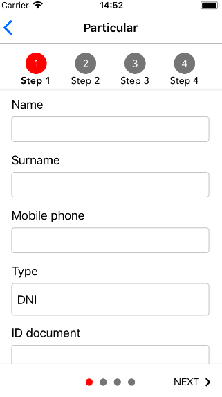

# react-native-js-stepper

<p>


</p>

React Native component to display a `Stepper`, a sequence of logical and numbered steps, frequently used for navigation.

See more on:

https://material.io/guidelines/components/steppers.html

<p align="center">

</p>

## Getting started

```sh
$ yarn add react-native-js-stepper
```

## Usage

```js
/* @flow */

import React from 'react'
import { StyleSheet } from 'react-native'
import Stepper from 'react-native-js-stepper'

type Props = {}

export default class ViewScreen extends React.Component<Props> {
  render() {
    return (
      <Stepper
        ref={(ref: any) => {
          this.stepper = ref
        }}
        validation={false}
        activeDotStyle={styles.activeDot}
        inactiveDotStyle={styles.inactiveDot}
        showTopStepper={true}
        showBottomStepper={true}
        steps={['Step 1', 'Step 2']}
        backButtonTitle="BACK"
        nextButtonTitle="NEXT"
        activeStepStyle={styles.activeStep}
        inactiveStepStyle={styles.inactiveStep}
        activeStepTitleStyle={styles.activeStepTitle}
        inactiveStepTitleStyle={styles.inactiveStepTitle}
        activeStepNumberStyle={styles.activeStepNumber}
        inactiveStepNumberStyle={styles.inactiveStepNumber}>
        <View />
        <View />
      </Stepper>
    )
  }
}

const styles = StyleSheet.create({
  activeDot: {
    backgroundColor: 'grey'
  },
  inactiveDot: {
    backgroundColor: '#ededed'
  },
  activeStep: {
    backgroundColor: 'grey'
  },
  inactiveStep: {
    backgroundColor: '#ededed'
  },
  activeStepTitle: {
    fontWeight: 'bold'
  },
  inactiveStepTitle: {
    fontWeight: 'normal'
  },
  activeStepNumber: {
    color: 'white'
  },
  inactiveStepNumber: {
    color: 'black'
  }
})
```

## API

|          Props          |     Type      |                             Description                              | Required |
| :---------------------: | :-----------: | :------------------------------------------------------------------: | :------: |
|       initialPage       |    number     |            Index of initial page that should be selected             |    No    |
|       onPressNext       |   Function    |    Function executed when `Next` button is pressed at the bottom     |    No    |
|       onPressBack       |   Function    |    Function executed when `Back` button is pressed at the bottom     |    No    |
|      onScrollPage       |   Function    |        Function executed when page is changed by scroll event        |    No    |
|     textButtonStyle     |    Object     |      Text styles of the `Back` and `Next` buttons at the bottom      |    No    |
|     backButtonTitle     |    string     |                      Title of the `Back` button                      |    No    |
|     nextButtonTitle     |    string     |                      Title of the `Next` button                      |    No    |
|     topStepperStyle     |    Object     |                      Styles of the top stepper                       |    No    |
|     showTopStepper      |    boolean    |                   If `true` shows the top stepper                    |    No    |
|     activeDotStyle      |    Object     |              Styles object of active dot at the bottom               |    No    |
|    inactiveDotStyle     |    Object     |             Styles object of inactive dot at the bottom              |    No    |
|          steps          | Array<string> | Array of strings that contains title of each step on the top stepper |    No    |
|     stepsTitleStyle     |    Object     |             Styles object for title of each step at top              |    No    |
|    showBottomStepper    |    boolean    |                    If `true` shows bottom stepper                    |    No    |
|  activeStepNumberStyle  |    Object     |                Styles object of number on active step                |    No    |
| inactiveStepNumberStyle |    Object     |               Styles object of number on inactive step               |    No    |
|  activeStepTitleStyle   |    Object     |                Styles object of title on active step                 |    No    |
| inactiveStepTitleStyle  |    Object     |               Styles object of title on inactive step                |    No    |
|       validation        |    boolean    |         Disables validation (related to top stepper numbers)         |    No    |
|                         |               |                                                                      |          |

## License

MIT License

Copyright (c) 2018 InterfaceKit

## Author

Antonio Moreno Valls `<amoreno at apsl.net>`

Built with 💛 by [APSL](https://github.com/apsl).
